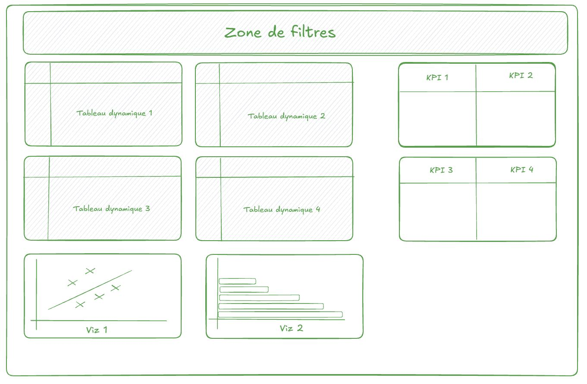
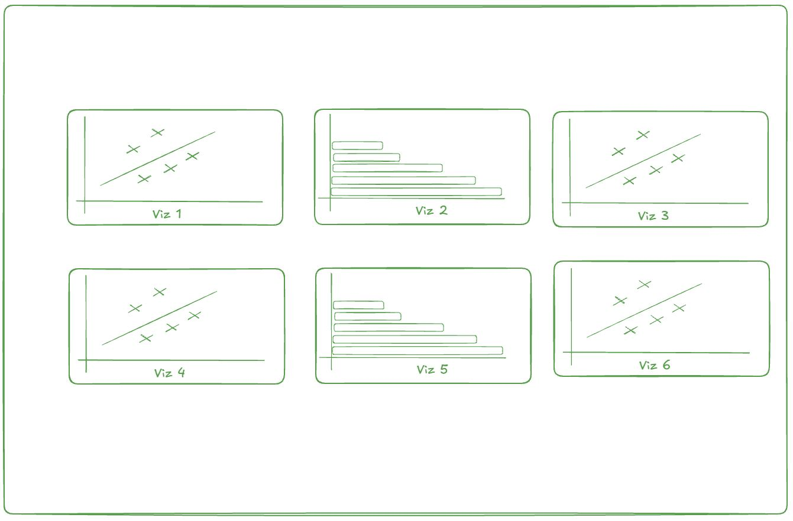

# GameSalesDash

Automatisation d'un reporting Excel sur les ventes de jeux vidéo.

## Contexte

Ce reporting s'adresse aux équipes business et market analysts de l'industrie du jeu vidéo : suivi des performances commerciales par territoire, comparaison entre plateformes, identification des tendances par genre et analyse des parts de marché par éditeur.

## Données

Source : [Kaggle Video Game Sales](https://www.kaggle.com/datasets/gregorut/videogamesales).

| Colonne | Type | Description |
|---|---|---|
| `rank` | int | Classement global par ventes |
| `name` | str | Titre du jeu |
| `platform` | str | Plateforme de sortie (PS3, X360, Wii…) |
| `year` | int | Année de sortie |
| `genre` | str | Genre (Action, Shooter, Sports…) |
| `publisher` | str | Éditeur |
| `na_sales` | float | Ventes Amérique du Nord (millions) |
| `eu_sales` | float | Ventes Europe (millions) |
| `jp_sales` | float | Ventes Japon (millions) |
| `other_sales` | float | Ventes autres régions (millions) |
| `global_sales` | float | Ventes mondiales (millions) |

16 598 entrées brutes, 307 lignes supprimées au nettoyage (valeurs manquantes sur `year` ou `publisher`).

## Aperçu

**TDB_1** Dashboard principal : filtres interactifs, tableaux TOP 5 par plateforme et indicateurs KPI.



**TDB_2** Dashboard d'ensemble : évolutions temporelles, répartition par genre et parts des éditeurs.


---

## Prérequis

- [uv](https://docs.astral.sh/uv/getting-started/installation/)
- Python 3.11+

---

## Installation

```bash
git clone https://github.com/surybang/GameSalesDash.git
cd GameSalesDash
uv sync
```

---

## Utilisation

```bash
uv run gamesalesdash
```

Le fichier est produit dans `result/Dashboards_videogames.xlsx`. Une version générée est également disponible directement sur [MinIO](https://minio.lab.sspcloud.fr/fabienhos/GameSalesDash/Dashboards_videogames.xlsx).

---

## Structure du projet

```
GameSalesDash/
├── pyproject.toml
├── uv.lock
├── .python-version
│
├── data/                       # Données
├── result/                     # Fichiers Excel générés
├── img/                        # Captures d'écran utilisées
│
├── notebooks/
│   └── projet.ipynb            # Notebook d'exploration
│
└── src/gamesalesdash/
    ├── __init__.py
    ├── config.py               # Constantes 
    ├── data.py                 # Chargement MinIO et nettoyage des données
    ├── dashboards.py           # Orchestration : assemble les onglets
    ├── main.py                 # Point d'entrée
    │
    ├── components/
    │   ├── filters.py          # Filtres déroulants
    │   ├── styles.py           # Bordures et styles partagés
    │   ├── tables.py           # Tableaux TOP 5
    │   ├── charts.py           # Graphiques
    │   └── indicators.py       # Cartes indicateurs
    │
    └── sheets/                 # Construction par onglet
        ├── cleaned_data.py     # Onglet cleaned_data
        ├── resources.py        # Onglet Ressources
        ├── tdb1.py             # Onglet TDB_1
        ├── calc_sheet.py       # Onglet calc_sheet
        └── tdb2.py             # Onglet TDB_2
```

### Rôle de chaque module

**`config.py`** centralise toutes les constantes duu projet.

**`data.py`** récupère les données et applique une fonction de nettoyage.

**`components/`** regroupe les briques de construction Excel : chaque module correspond à une responsabilité précise (filtres, styles, tables, graphiques, indicateurs).

**`sheets/`** contient un module par onglet du classeur.

**`dashboards.py`** assemble les onglets dans l'ordre et retourne le classeur.

**`main.py`** appelle le pipeline complet : chargement, nettoyage, construction, sauvegarde.